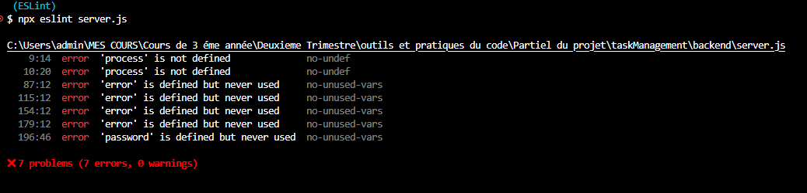
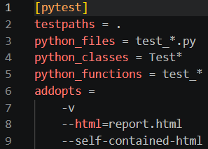
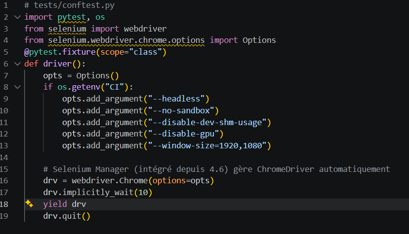
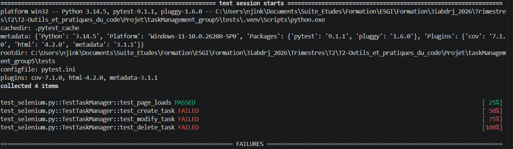

# taskmanagement
Application de gestion de tâches

### Configuration et Organisation

1. **Création du repository GitHub**

On a créé le repository sur GitHub et ajouté des collaborateurs, on a cloné le repositoire sur l'ordinateur et mis en place l'arborescence du projet en base à la documentation fournie, ensuite on a fait le premier commit pour publier la branch main et que tous puissent commencer à travailler dessus.

On a essayé d'utiliser `git remote set-url` pour mettre à jour l'url du repo, mais on a vu que y avait tout une historique des commits (de l'ancien url). On a donc décidé de tout recommencer en faisant l'arborescence du projet manuelement.

git clone https://github.com/migueleozs/taskManagement_group5
cd taskManagement_group5
mkdir frontend backend tests .github
mkdir .github/workflows

touch README.md

git add .
git commit -m "Premier Organization d'arborescence"
git push origin main


2. **Configuration du workflow**

Nous avons choisi le workflow `Feature Branch` : 
Une branche par fonctionnalité. À
chaque nouvelle fonctionnalité, une nouvelle branche est
créée. Une fois la fonctionnalité codée et testée, fusion de la
branche avec master.


**Analyse de code** avec ESLint
- On a installer ESLint en utilisant npm ou yarn ,

- puis on a lancer la commande : "npm install eslint --save-dev",

- Après on a initialiser ESLint en exécutant la commande
d’initialisation: "npx eslint --init",

-Avec cette commande un fichier de configuration  ESLint créera un fichier contenant  (.eslintrc.json ou .eslintrc.js pour des
versions antérieures à ESLint V9) dans lequel on va personnaliser les règles et les paramètres.



on a executer le fichier server.js qui se trouve dans le backend et on à obtenu 7 erreur mais qui n'empeche pas l'execusion du code en soit .
-les deux premiers erreurs disent que la variable process n'a pas été definie;
-le reste des erreurs disent que les variables on été definie pas utiliser;


Cette erreur signifie que ESLint ne reconnaît pas les modules ES6 (import/export) car la configuration par défaut utilise sourceType: script.


### Développement Collaboratif

1. **Frontend**

2. **Backend**

3. **Tests**

Nous avons suivi la même logique que lors du tp de cours su Selenium.

a. Activation du venv et Installation des dépendances
Dans le `requirements.txt`, on a installé les librairies
```txt
selenium>=4.27.1
pytest>=8.3.4
pytest-html>=4.1.1
pytest-cov>=5.0.0
webdriver-manager>=4.0.2
```
b. Fichiers de configuration Pytest et fixtures
- pytest.ini

- conftest.py


Puis l'implémentation proprement dit des test

Nous avons fait un test automatisant un CRUD complet (Connexion, création, modification, supression d'une tâche) à travers les fonctions
`_login_user`, `test_page_loads`, `test_create_task`, `test_modify_task`, `test_delete_task`

Ce n'est que le test de login qui est passé. Nous avons eu une erreur sur la création, la modification et la suppression.

Nous n'avons pas eu le temps d'affiner pour corriger les bugs signalé




### CI/CD et Déploiement

1. **Intégration Continue**

2. **Déploiement Continu**

3. **Conteneurisation**

pour la contenerisation de backend et frontend on a créer:
un fichier dockerfile dans le backend 
un fichier dockerfile dans le frontend
puis un fichier docker-compose.yml dans la racine du projet

par apres on a lancer les commandes suivantes : 
# 1. Build et démarrage (première fois)
docker-compose up --build

# 2. Démarrer en arrière-plan (détaché)
docker-compose up -d
# 3. Voir les logs
docker-compose logs -f

# 4. Arrêter les conteneurs
docker-compose down

fin