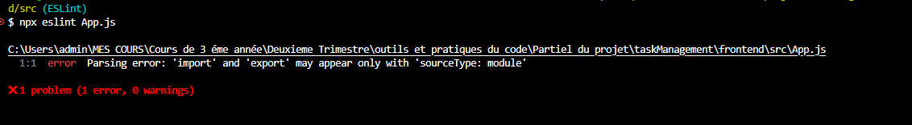

2. **Analyse de code** avec ESLint
- On a installer ESLint en utilisant npm ou yarn ,

- puis on a lancer la commande : "npm install eslint --save-dev",

- Après on a initialiser ESLint en exécutant la commande
d’initialisation: "npx eslint --init",

-Avec cette commande un fichier de configuration  ESLint créera un fichier contenant  (.eslintrc.json ou .eslintrc.js pour des
versions antérieures à ESLint V9) dans lequel on va personnaliser les règles et les paramètres.

on a executer le fichier server.js qui se trouve dans le backend et on à obtenu 7 erreur mais qui n'empeche pas l'execusion du code en soit .
-les deux premiers erreurs disent que la variable process n'a pas été definie;
-le reste des erreurs disent que les variables on été definie pas utiliser;

Cette erreur signifie que ESLint ne reconnaît pas les modules ES6 (import/export) car la configuration par défaut utilise sourceType: script.